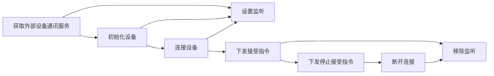

# 详细API说明

### 集成

#### 本地依赖

将Demo中app/libs目录下的device\_communicate\_serialport-0.0.4.aar文件

#### gradle自动依赖

在项目根目录的build.gradle文件下添加以下依赖：

```groovy
repositories {
    mavenCentral()
}
```

在所需的module中的build.gradle文件下添加以下依赖：

    implementation 'cn.entertech.android:device_communicate_serialport:0.0.4'

### 外设-串口管理类

**方法说明**

该类集成了外设-串口的所有操作

**示例代码**

```kotlin
val manage = BaseExternalDeviceCommunicationManage.getManage(ExternalDeviceType.SERIAL_PORT)
```

### 设备初始化

    manage?.initDevice(context)

### 设备连接

**方法说明**

连接串口设备

**示例代码**

```kotlin
  manage?.connectDevice(this, {
    Log.d(TAG, "connectDevice success")
}) { errorCode, errorMsg ->
    Log.e(TAG, "errorCode: $errorCode  errorMsg: $errorMsg")
}

```

**参数说明**

| 参数             | 类型                       | 说明            |
| -------------- | ------------------------ | ------------- |
| context        | Context                  | 上下文，启动服务，注册广播 |
| connectSuccess | (() -> Unit)?            | 连接成功回调        |
| connectFail    | ((Int, String) -> Unit)? | 连接失败：错误码，错误信息 |

### 设备断开

**方法说明**

断开与设备的连接

**示例代码**

```kotlin
manage?.disConnectDevice()
```

### 获取设备连接状态

**方法说明**

获取当前设备连接状态

**示例代码**

```kotlin
val isConnected = manage?.isConnected()
```

**返回值说明**

| 参数          | 类型      | 说明                    |
| ----------- | ------- | --------------------- |
| isConnected | Boolean | 设备已连接为true，未连接为false。 |


### 添加|移除 断开连接成功监听

**方法说明**

添加|移除 断开连接成功监听，断开连接成功回调

**示例代码**

```kotlin
private val disconnectListener:(String)->Unit by lazy {
    {
//todo
    }
}

manage?.addDisConnectListener(disconnectListener)

```

监听接口生命周期需要管理，不需要监听了，请调用remove
```kotlin
manage?.removeDisConnectListener (disconnectListener)
```

### 添加|移除 连接成功监听

**方法说明**

添加连接|移除成功监听，连接成功回调

**示例代码**

```kotlin
 private val connectListener by lazy {
        {
//todo
        }
    }

manage?.addConnectListener(connectListener)

```

监听接口生命周期需要管理，不需要监听了，请调用remove
```kotlin
manage?.removeConnectListener (connectListener)
```


### 添加原始数据监听

**方法说明**

添加原始数据监听，通过该监听可从硬件中获取原始数据

**示例代码**

      var rawDataListener = fun(data:ByteArray){
            Logger.d(Arrays.toString(data))
      }
      manage?.addRawDataListener(rawDataListener)

**原始数据说明**

| 包头             | 包长度  | 心率数据         | 脱落检测数据             | 第一个数据（左通道） | 第二个数据（右通道） | 第三个数据（左通道） | 第四个数据（右通道） | ........ | 第9个数据    | 第10个数据   | 校验位（单字节对比校验） | 包尾             |
| :------------- | :--- | :----------- | :----------------- | :--------- | :--------- | :--------- | :--------- | :------- | :------- | :------- | :----------- | :------------- |
| 3字节            | 1字节  | 1字节          | 1字节                | 3个字节       | 3个字节       | 3个字节       | 3字节        | ........ | 3个字节     | 3个字节     | 1字节          | 3字节            |
| 0xBB-0xBB-0xBB | 0x28 | 0x00(心率数据为0) | 0x00(0为佩戴正常，非0为脱落) | 00-01-02   | 03-04-05   | 06-07-08   | 09-0A-0B   | ........ | 00-01-02 | 00-01-02 | 0x77         | 0xEE-0xEE-0xEE |

#### 添加原始脑波监听

**方法说明**

添加原始脑波监听，通过该监听可从硬件中获取原始脑波数据

**示例代码**

```kotlin
  var bioAndAffectDataListeners = fun(data:ByteArray){
    Logger.d(Arrays.toString(data))
}
manage?.addBioAndAffectDataListener(rawDataListener)
```

**参数说明**

| 参数                       | 类型                | 说明     |
| ------------------------ | ----------------- | ------ |
| bioAndAffectDataListener | （ByteArray）->Unit | 原始脑波回调 |

> **原始脑波数据说明**
>
> 从脑波回调中返回的原始脑波数据是一个长度为30的字节数组，其中脑波数据分左右两个通道，
> 依次为：左通道、左通道、左通道、右通道、右通道、右通道、左通道、左通道、左通道、右通道、右通道、右通道、左通道、左通道、左通道、右通道、右通道、右通道。。。。
>
> **正常数据示例**
>
> \[0, -94, 21, -36, 125, 21, -12, -75, 22, 8, 61, 22, 10, -72, 22, 15, -19,20,10,8]
>
> **异常数据示例（未检测到脑波数据）**
>
> \[-1, -1, -1, -1, -1, -1, -1, -1, -1, -1, -1, -1, -1, -1, -1, -1, -1,-1,-1,-1]

#### 移除原始脑波监听

**方法说明**

如果不想受到脑波数据，移除监听即可

**示例代码**

```kotlin
manage?.removeRawDataListener(rawDataListener)
```

**参数说明**

| 参数              | 类型                | 说明     |
| --------------- | ----------------- | ------ |
| rawDataListener | （ByteArray）->Unit | 原始脑波回调 |

#### 添加心率监听

**方法说明**

添加心率监听，通过该监听可从硬件中获取心率数据

**示例代码**

```kotlin
var heartRateListener = fun(heartRate: Int) {
    Logger.d("heart rate data is " + heartRate)
}
manage?.addHeartRateListener(heartRateListener)
```

**参数说明**

| 参数                | 类型          | 说明       |
| ----------------- | ----------- | -------- |
| heartRateListener | （Int）->Unit | 心率数据获取回调 |

#### 移除心率监听

**方法说明**

如果不想收到心率，移除监听即可

**示例代码**

```kotlin
manage?.removeHeartRateListener(heartRateListener)
```

**参数说明**

| 参数                | 类型          | 说明     |
| ----------------- | ----------- | ------ |
| heartRateListener | （Int）->Unit | 心率数据回调 |

#### 添加佩戴信号监听

**方法说明**

添加该监听，可实时获取设备佩戴质量

**代码示例**

```kotlin
contactListener = fun(state: Int) {
    Logger.d("Whether the wearing contact is good:"+ state == 0);
}
manage?.addContactListener(contactListener)

```

**参数说明**

| 参数              | 类型          | 说明                      |
| --------------- | ----------- | ----------------------- |
| contactListener | （Int）->Unit | 佩戴信号回调。0:接触良好，其他值：未正常佩戴 |

#### 移除佩戴信号监听

**方法说明**

移除该监听，则不会受到佩戴信号

**代码示例**

```kotlin
manage?.removeContactListener(contactListener)
```

**参数说明**

| 参数              | 类型          | 说明     |
| --------------- | ----------- | ------ |
| contactListener | （Int）->Unit | 佩戴信号回调 |

**参数说明**

| 参数                     | 类型              | 说明     |
| ---------------------- | --------------- | ------ |
| batteryVoltageListener | （Double）-> Unit | 电池电压回调 |

#### 开始脑波和心率数据同时采集

**方法说明**

开始心率数据采集，调用这个接口开始同时采集脑波和心率数据

**示例代码**

```kotlin
manage?.startHeartAndBrainCollection()
```

#### 停止脑波和心率数据采集

**方法说明**

停止采集，调用该方法停止采集脑波和心率数据

**示例代码**

```kotlin
manage?.stopHeartAndBrainCollection()
```

#### 流程图



### 辅助功能

##### **调式日志**

如果调试阶段需要打印日志调用如下方法：

```kotlin
ExternalDeviceCommunicateLog.printer=object :ILogPrinter{
    override fun d(tag: String, msg: String) {
    }

    override fun i(tag: String, msg: String) {
    }

    override fun e(tag: String, msg: String) {
    }
}
```

内部默认使用DefaultLogPrinter

    object DefaultLogPrinter:ILogPrinter {
        override fun d(tag: String, msg: String) {
            Log.d(tag, msg)
        }

        override fun i(tag: String, msg: String) {
            Log.i(tag, msg)
        }

        override fun e(tag: String, msg: String) {
            Log.e(tag, msg)
        }
    }

##### **数据校验接口IProcessDataHelper**

```kotlin
interface IProcessDataHelper {

    /**
     * @param byteInt 读取出来的字节
     * @param contactListeners 佩戴监听 is [BaseExternalDeviceCommunicationManage.contactListeners]
     * @param bioAndAffectDataListeners 生物基础数据&情感数据监听 is [BaseExternalDeviceCommunicationManage.bioAndAffectDataListeners]
     * @param heartRateListeners 心率监听 is [BaseExternalDeviceCommunicationManage.heartRateListeners]
     * @param finish 拿到完整的数据包结构时候的回调
     * */
    fun process(
        byteInt: Byte,
        contactListeners: List<((Int) -> Unit)?>,
        bioAndAffectDataListeners: List<((ByteArray) -> Unit)?>,
        heartRateListeners: List<((Int) -> Unit)>?,
        finish: (() -> Unit)? = null
    )
}

```

默认为ProcessDataTools，若需要自定义校验规则 获取到BaseExternalDeviceCommunicationManage时就应该设置
```kotlin
BaseExternalDeviceCommunicationManage.mIProcessDataHelper = MyProcessDataHelper()

```

##### **数据适配器接口IDataAdapter**
仅适用于ProcessDataTools中
```kotlin


interface IDataAdapter<T> {

    fun dataAdapter(originData: T, newDataCallback: (T) -> Unit)
}


```
**参数说明**

| 参数                     | 类型              | 说明     |
| ---------------------- | --------------- | ------ |
| originData | T | 源数据，即 从ProcessDataTools中 获取到的一个完整数据包|
| newDataCallback | T | 新数据，经过处理后的新的完整数据包|

该接口用途：从串口获取到的源数据转化为所使用的算法所支持数据包，
若需要自定义数据适配 则可以这么设置
```kotlin
    val helper = BaseExternalDeviceCommunicationManage.mIProcessDataHelper
    
    if ( helper is ProcessDataTools ) {
        helper.mIDataAdapter = MyDataAdapter
    }

```